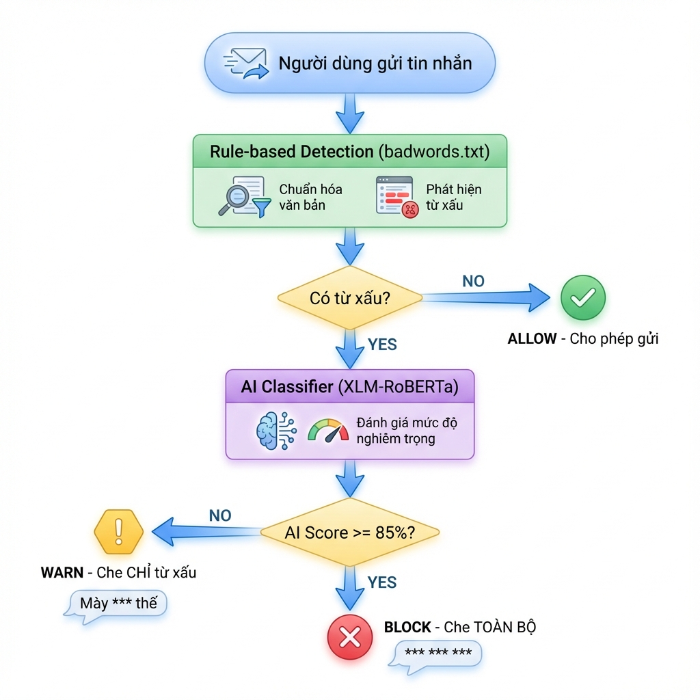

# 📋 Hệ Thống Kiểm Duyệt Tin Nhắn - Smart Text Sanitizer

## Tổng Quan

Hệ thống kiểm duyệt thông minh kết hợp **Rule-based** (từ điển badwords) và **AI Classifier** (XLM-RoBERTa) để phát hiện và xử lý nội dung vi phạm.

---

## Sơ Đồ Luồng Hoạt Động



---

## Chi Tiết Từng Bước

### Bước 1: Người Dùng Gửi Tin Nhắn

Khi người dùng nhập và gửi tin nhắn, hệ thống sẽ nhận văn bản gốc.

```
Ví dụ: "Mày ngu thế đấy"
```

---

### Bước 2: Rule-based Detection (Phát Hiện Từ Xấu)

Hệ thống sử dụng file `badwords.txt` chứa **267 từ cấm** để phát hiện:

#### Quy trình xử lý:

| Bước | Mô tả | Ví dụ |
|------|-------|-------|
| 1. Lowercase | Chuyển thường | "Mày ngu thế đấy" → "mày ngu thế đấy" |
| 2. Bỏ dấu tiếng Việt | Normalize | "mày ngu thế đấy" → "may ngu the day" |
| 3. Chống leet speak | @→a, $→s, !→i | "d!t m3" → "dit me" |
| 4. Pack text | Bỏ khoảng trắng | "d i t m e" → "ditme" |
| 5. So khớp badwords | Tìm trong từ điển | match: "ngu" ✓ |

#### Bắt biến thể:
- `"địt mẹ"` → match ✓
- `"d i t m e"` → match ✓ (có khoảng trắng)
- `"d!t m3"` → match ✓ (leet speak)
- `"Đ.ị.t m.ẹ"` → match ✓ (chèn dấu chấm)

---

### Bước 3: Kiểm Tra Có Từ Xấu?

```
                    ┌──────────────────┐
                    │   Có từ xấu?     │
                    └────────┬─────────┘
                             │
              ┌──────────────┴──────────────┐
              │                             │
        Không có                        Có từ xấu
              │                             │
              ▼                             ▼
    ┌─────────────────┐         ┌─────────────────────┐
    │   ✅ ALLOW      │         │ Tiếp tục Bước 4     │
    │   Giữ nguyên    │         │ (Gọi AI Classifier) │
    └─────────────────┘         └─────────────────────┘
```

---

### Bước 4: AI Classifier (Đánh Giá Mức Độ)

Nếu phát hiện từ xấu, hệ thống sẽ gọi **AI model** để đánh giá mức độ nghiêm trọng.

**Model:** `christinacdl/XLM_RoBERTa-Offensive-Language-Detection-8-langs-new`

| Đặc điểm | Thông tin |
|----------|-----------|
| Kiến trúc | XLM-RoBERTa (multilingual) |
| Ngôn ngữ | 8+ ngôn ngữ (bao gồm tiếng Việt) |
| Output | Label (NOT/OFFENSIVE) + Score (0.0-1.0) |

---

### Bước 5: Decision Engine (Quyết Định)

Dựa trên **AI Score** để quyết định hành động:

| AI Score | Quyết Định | Xử Lý |
|----------|------------|-------|
| < 85% | ⚠️ **WARN** | Che CHỈ từ xấu |
| ≥ 85% | ❌ **BLOCK** | Che TOÀN BỘ tin nhắn |

---

## Ví Dụ Thực Tế

### Trường hợp 1: Tin nhắn bình thường (ALLOW)

```
Input:  "Xin chào bạn, hôm nay thế nào?"
│
├── Rule-based: Không tìm thấy từ xấu
│
└── Output: ✅ ALLOW
    "Xin chào bạn, hôm nay thế nào?"
```

---

### Trường hợp 2: Vi phạm nhẹ (WARN)

```
Input:  "Cái này hơi ngu"
│
├── Rule-based: hits = ["ngu"]
│
├── AI Score: 0.72 (72%) < 85%
│
└── Output: ⚠️ WARN - Che từ xấu
    "Cái này hơi ***"
```

---

### Trường hợp 3: Vi phạm nặng (BLOCK)

```
Input:  "Địt mẹ mày"
│
├── Rule-based: hits = ["ditme"]
│
├── AI Score: 0.99 (99%) ≥ 85%
│
└── Output: ❌ BLOCK - Che toàn bộ
    "*** ** ***"
```

---

### Trường hợp 4: Biến thể (BLOCK)

```
Input:  "d i t m e mày ơi"
│
├── Rule-based: hits = ["ditme"] (bắt biến thể có khoảng trắng)
│
├── AI Score: 0.75 (75%) < 85%
│
└── Output: ⚠️ WARN - Che từ xấu
    "********* mày ơi"
```

---

## Cấu Trúc File

```
common/moderation/
├── text_sanitizer.py    # Module chính - Smart Text Sanitizer
├── text_filter.py       # Rule-based engine (badwords detection)
├── ai_classifier.py     # AI Classifier (XLM-RoBERTa)
├── badwords.txt         # Danh sách 267 từ cấm
└── types.py             # Constants (ACTION_ALLOW, WARN, BLOCK)
```

---

## Cách Sử Dụng

```python
from common.moderation.text_sanitizer import SmartTextSanitizer

# Khởi tạo
sanitizer = SmartTextSanitizer()

# Kiểm tra tin nhắn
result = sanitizer.sanitize("Mày ngu thế")

print(result)
# {
#     "action": "BLOCK",
#     "original_text": "Mày ngu thế",
#     "censored_text": "*** *** ***",
#     "reason": "Tin nhắn vi phạm nặng",
#     "hits": ["ngu"],
#     "ai_score": 0.91
# }
```

---

## Ngưỡng Cấu Hình

Có thể điều chỉnh ngưỡng trong `ai_classifier.py`:

```python
class ToxicAIClassifier:
    THRESHOLD_WARN = 0.45   # Score >= này sẽ WARN
    THRESHOLD_BLOCK = 0.85  # Score >= này sẽ BLOCK
```
